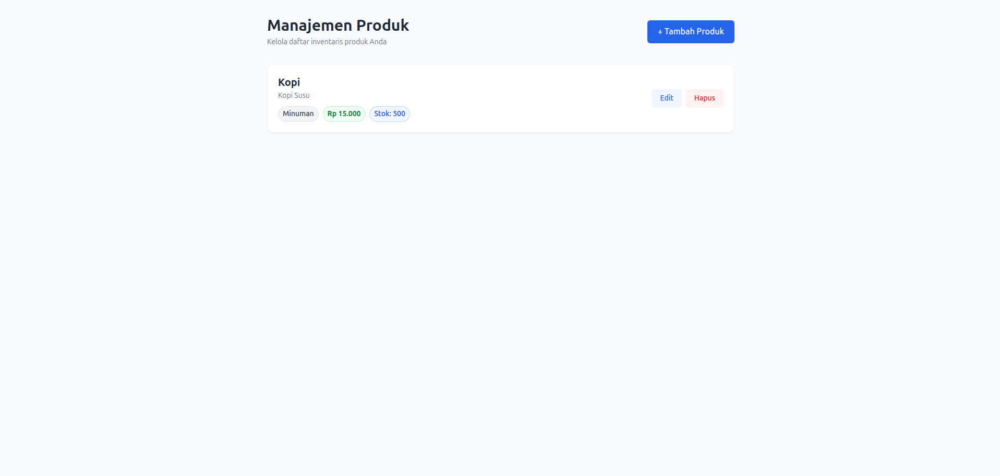
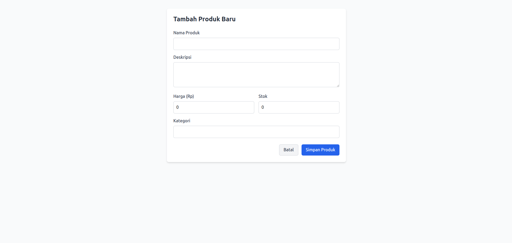
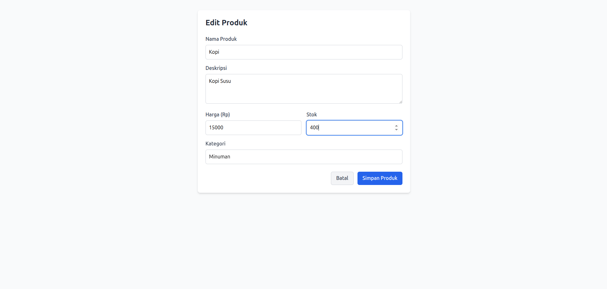

# TPT Digital - Fullstack Developer Intern Task

Halo! Perkenalkan, saya **Diandra Yusuf Arrafi**. 

Repositori ini dibuat sebagai hasil pengerjaan tugas *technical test* untuk melamar posisi **Fullstack Developer Intern** di **TPT Digital**. Aplikasi ini adalah Sistem Manajemen Produk sederhana yang mengimplementasikan operasi CRUD (Create, Read, Update, Delete).

Untuk menjaga struktur kode tetap rapi dan *modular*, *source code* untuk proyek ini dipisahkan ke dalam dua *branch* yang berbeda.

---

## Akses Source Code

Silakan kunjungi tautan di bawah ini untuk melihat detail *source code* beserta dokumentasi teknis untuk masing-masing bagian:

*   **Frontend (React, TypeScript, Tailwind CSS, Vite):**
    👉 [Frontend](https://github.com/haloYusuf/tpt_fullstack_dev_test/tree/frontend)

*   **Backend (Go, REST API, PostgreSQL):**
    👉 [Backend](https://github.com/haloYusuf/tpt_fullstack_dev_test/tree/backend)

---

## Cara Melakukan Clone & Setup

Jika Anda ingin mencoba menjalankan proyek ini di mesin lokal, Anda dapat melakukan *clone* repositori ini dan berpindah ke *branch* yang ingin diuji:
```bash
# 1. Clone repositori ke mesin lokal Anda
git clone https://github.com/haloYusuf/tpt_fullstack_dev_test.git

# 2. Masuk ke dalam direktori proyek
cd tpt_fullstack_dev_test

# 3. Untuk menjalankan api, pindah ke branch backend
git checkout backend
# (Lihat README.md di branch backend)

# 4. Pindah ke branch frontend untuk menjalankan UI (React)
git checkout frontend
# (Lihat README.md di branch frontend)
```

---

## Tangkapan Layar Aplikasi

Berikut adalah pratinjau antarmuka web dari aplikasi Manajemen Produk yang telah dibangun:

### 1. Halaman Utama (Home / Katalog Produk)
Menampilkan daftar produk yang diambil langsung dari *database*. Terdapat indikator stok dan kategori, serta tombol aksi untuk Edit dan Hapus.



### 2. Halaman Tambah Produk (`/add`)
Antarmuka untuk memasukkan data produk baru ke dalam sistem.



### 3. Halaman Edit Produk (`/edit/:id`)
Formulir yang secara otomatis memuat dan menampilkan data produk yang dipilih pengguna untuk diperbarui.


